# The network, its three regimes and its controls

How the connectome of [02](02_connectome-construction.md) becomes a network that can be simulated and
trained, what "frozen weights" means in each of the three regimes, how the null controls are built, and how
the construction is checked against the published model it generalises. Everything here is implemented in
`data-pipeline/conectoma/network/` and `data-pipeline/conectoma/connectome/nulls.py`.

## From a specification to a network

### Why the product compiles its own graph

The engine (`flyvis`, see [its card](../frameworks/01_flyvis.md)) ships a compiler for the average-filter
format, `ConnectomeFromAvgFilters`. It is the reference the product's compiler is tested against, table for
table, and it is not used directly for four reasons, each of which either bit during this unit or would have:

1. It caches every compiled graph on disk under a key made of its arguments, and for a specification file
   that key is the path, not the content. A rebuilt connectome at the same path silently loads the old
   graph. The product's compiler keeps the graph in memory and records the SHA-256 of the specification in
   the network's configuration, so a checkpoint names the exact graph it was trained on and loading it
   against a changed file fails.
2. Every null-control seed is a different graph. The disk cache would keep a compiled copy of each (tens of
   megabytes at the measured size) for a network used once.
3. Its edge construction is a Python loop over every source cell of every filter entry. The product's
   compiler vectorises each filter entry and builds the MaleCNS lattice in about three seconds.
4. It expands filters from their sources, which loses entries as soon as cell types sit on sublattices
   (below). The published connectome has almost no sublattices; the MaleCNS one has many.

### Placement: every type at its measured density

A cell type is laid out at the density it has in the eye: on every column, or on every k-th column along
both lattice axes (one cell per k*k columns), with k the closest match to the measured cells per column.
The rule and its measured outcome on the right optic lobe (893 columns):

| Placement | Density that maps to it | Cell types |
|---|---|---|
| every column | more than 0.44 cells per column | 44 |
| every second column (2x2) | 0.16 to 0.44 | 27 |
| every third column (3x3) | 0.08 to 0.16 | 31 |
| every fourth column (4x4) | 0.049 to 0.08 | 22 |
| one population node | below 0.049 (fewer than about 44 cells) | 129 |

Every photoreceptor type sits on every column, which the engine requires of an input (the stimulus lands
on one cell of every input type in every column); the build refuses a specification where that fails.

### Expansion: from the targets, not from the sources

A filter entry says how many synapses a target cell receives, on average, from source cells at a given
column offset. The engine expands it from the sources: every source cell sends the entry to the column at
the offset, if a target cell is there. When both types sit on every column that is exact. When they sit
on sublattices that share the origin, two cells of the two types are only ever apart by offsets that are
multiples of both strides, and every other entry falls between cells and is lost. In the diagram, five of
seven targets receive nothing.

The product expands every filter from its targets instead (`target_centric` in the specification's
`compile` block). Every target cell receives every entry of its measured filter; the source position an
entry points at is served by the nearest cell of the source type's sublattice, and entries that land on the
same source cell are summed. With $F_{t_i t_j}(\Delta u, \Delta v)$ the measured filter and
$\mathcal{S}_{t_j}$ the sublattice of the source type,

$$N_{ij} = \sum_{(\Delta u, \Delta v)\,:\,\operatorname{snap}_{\mathcal{S}_{t_j}}(u_i - \Delta u,\, v_i - \Delta v) = (u_j, v_j)} F_{t_i t_j}(\Delta u, \Delta v),$$

so that $\sum_j N_{ij} = \sum_{(\Delta u, \Delta v)} F_{t_i t_j}(\Delta u, \Delta v)$ for every target cell $i$
whose filter fits inside the lattice. Measured on the right optic lobe: of the 2,873 connections between
placed types whose filters could be checked away from the lattice edge, every target cell receives its
filter total to float32 precision (largest relative error 6e-8).

A type sparser than the coarsest sublattice is one population node standing for the mean activity of its
cells (`population_broadcast`). It receives through its filter like a cell at the centre, and it drives
every cell of each target type with the measured average synapses per target cell over the whole pair,
computed over every selected neuron regardless of column or distance. A windowed per-offset filter would
understate exactly these wide-field types.

### The graph that results

| | Published consensus (FIB-25 and FIB-19) | MaleCNS right optic lobe |
|---|---|---|
| cell types | 65 | 253 |
| cells on the lattice of radius 15 | 45,669 | 40,051 |
| connections between cells | 1,513,231 | 2,922,900 |
| type-level connections in the specification | 605 | 7,907 |
| type-level connections the expansion cannot realise | 1 (Lawf1 onto Lawf1) | 4 |

The four unrealised MaleCNS connections are between a sublattice type and a population target whose whole
filter points beyond the lattice (Li25 to Li31, MeLo2 to MeVPLp2, MeLo2 to Pm13, Mi16 to Pm13). The
compiler reports every unrealised connection by name.

One finding about the published model came out of the parity check: the engine's own expansion drops the
published Lawf1 self-connection. Lawf1 sits on a 3-by-2 sublattice and its self-connection has a single
entry, one synapse at offset (1, 0), a distance no two Lawf1 cells are apart by. The published model was
trained on the graph without it. The effect is one synapse, but it is the same mechanism that would have
removed most of the MaleCNS wiring.

## Dynamics

The network is the engine's passive point-neuron model with graded, instantaneous synapses, transcribed
from Lappalainen et al., Nature 2024 (Methods):

$$\tau_{t_i}\,\frac{dV_i}{dt} = -V_i + \sum_j \alpha_{t_i t_j}\,\sigma_{t_i t_j}\,N_{ij}\,\operatorname{ReLU}(V_j) + V^{\mathrm{rest}}_{t_i} + e_i$$

- $V_i$ the voltage of cell $i$, $t_i$ its cell type;
- $N_{ij}$ the synapse count of the connection, from the connectome (the expansion above);
- $\sigma_{t_i t_j} \in \{-1, +1\}$ the sign of the presynaptic type, from the neurotransmitter predictions;
- $\alpha \ge 0$ a synaptic strength, initialised as $\alpha = 0.01 / \langle N \rangle$ over the
  connection's group and clamped non-negative;
- $\tau \ge \Delta t$ a time constant, initialised at 50 ms; $V^{\mathrm{rest}}$ a resting potential drawn
  from $\mathcal{N}(0.5, 0.05)$;
- $e_i$ the visual input, non-zero only for the photoreceptors.

It is integrated with an explicit Euler step: $\Delta t$ = 20 ms for training clips and 5 ms for the
characterisation stimuli, after grey input to a steady state.

## The three regimes

In every regime the wiring, the synapse counts and the signs are the measured connectome and never change.
What differs is which of the remaining quantities a task may adjust:

| Regime | Trainable inside the network | Granularity | Trainable, right optic lobe |
|---|---|---|---|
| R0 reservoir | nothing | - | 0 |
| R1 biophysical | $\alpha$, $\tau$, $V^{\mathrm{rest}}$ | per connected type pair; per cell type | 8,409 |
| R2 edge gain | $\alpha$, $\tau$, $V^{\mathrm{rest}}$ | per individual connection; per neuron | 3,003,002 |

R0 is the literal reading of a connectome used as an architecture with frozen weights: only a readout
outside the network learns, and activity can be simulated once per clip and cached. R1 is the regime of the
published model, whose 734 trained parameters are exactly these three kinds on its 65 types. R2 keeps every
connection and its sign and lets each one scale on its own, the most freedom that still respects the
wiring. The edge gain is the engine's own non-negative strength, one per connection, rather than an
exponential gain: both describe the same set of networks (a non-negative scale per connection), and the
engine's parameter keeps the sign, the clamp and the checkpoint format of the published model.

The synapse counts are held per connection in every regime (frozen). After the target-centric expansion the
same type pair and offset can carry different counts at different targets, and the engine's default of one
count per type pair and offset would average them away. Loading a published checkpoint uses the published
grouping instead, which is exact for its graph.

### What is checked about the regimes

- **Counts.** R0 trains nothing; R1 trains two values per cell type and one per connected type pair; R2 two
  per cell and one per connection. Asserted in the tests on a synthetic connectome, and measured on the
  right optic lobe (the table above).
- **Gradients.** The flag on a parameter is a promise. A short simulation with a gradient flowing from the
  input checks it through the dynamics: every frozen parameter receives no gradient and every trainable one
  a non-zero gradient, in all three regimes (tested; zero violations on the right optic lobe).
- **One starting point.** All three regimes start from identical values: they are built at type
  granularity first and broadcast to the finer granularity of R2, and a copy that would lose values (into a
  coarser grouping) is refused. A comparison between regimes therefore compares what training was allowed
  to change, never where it started.

### Two starting points

- **The engine's initialisation** (above), with a recorded seed.
- **Transfer from the published model.** Where a MaleCNS cell type matches a type of the published model
  (through the cross-release renames of [02](02_connectome-construction.md)), its trained time constant and
  resting potential are copied, averaged where one type here stands for several there (R1-R6 for six). A
  trained synaptic strength is copied per matched type pair so that the total drive onto a central cell is
  preserved:

  $$\alpha^{\mathrm{here}}_{t_i t_j} = \alpha^{\mathrm{pub}}_{t_i t_j}\,\frac{S^{\mathrm{pub}}_{t_i t_j}}{S^{\mathrm{here}}_{t_i t_j}}, \qquad S_{t_i t_j} = \sum_{j \in t_j} N_{c(t_i),\,j},$$

  where $c(t_i)$ is the central cell of the target type. A per-synapse copy would carry the difference
  between the two reconstructions' synapse counts straight into the dynamics. Measured: 53 of 253 cell
  types and 388 of 7,903 type pairs receive published values; everything else keeps the engine's
  initialisation.

## The null controls

Every claim that "the connectome helps" is tested against networks that keep one property of the measured
wiring and destroy the rest. The precedent is the robot-navigation work that trained on the full fly brain
(Wang and Chen, arXiv 2607.00025, 2026), whose degree-matched random graph is what makes its
out-of-distribution result readable at all.

| Control | Keeps | Destroys | Invariant asserted in the tests |
|---|---|---|---|
| N1 degree-preserving rewiring | every type's in- and out-degree, every filter, the synapse total | which types connect to which | identical degree sequences, identical synapse total, no duplicate connection, under half of the connections left in place |
| N2 size-matched random graph | the number of connections, the pool of measured filters | the degree structure as well | same size, same filter multiset, degrees no longer the measured ones |
| N3 sign shuffle | wiring and filters | which connections are inhibitory | same connections, same filters, same excitation-to-inhibition ratio |

Size has to match where the network is simulated, at the level of cells. Cell types sit on lattices of
different densities, so a filter moved onto a denser target type expands into more cell connections. The
first version of the controls moved connections freely, and a rewired MaleCNS control compiled to 6.85
million cell connections carrying 3.3 times the synapses of the measured 2.92 million: a comparison against
it would have compared drives, not wiring. Both graph-changing controls now move a connection only between
cell types of the same placement (rewiring swaps targets within a placement; the random graph redraws each
connection between types of its original source and target placements). A connection's source placement,
target placement and filter decide how many cell connections it becomes, so every control compiles to
exactly the measured size:

| Network | Cell connections | Synapses | Changed |
|---|---|---|---|
| measured | 2,922,900 | 10,281,886 | - |
| N1, seed 0 | 2,922,900 | 10,281,886 | 41,531 of 79,070 swaps accepted |
| N2, seed 0 | 2,922,900 | 10,281,886 | all 7,907 connections redrawn |
| N3, seed 0 | 2,922,900 | 10,281,886 | 3,616 of 7,907 signs changed |

Rewiring is done with double-edge swaps (ten attempts per connection, acceptance reported). Rewiring keeps
every connection's source, so its sign is unchanged; in the random graph a connection takes the sign of its
new source, because a neuron releases one transmitter onto all its targets. Every control is a pure
function of the measured specification and a seed, and carries the version of the algorithm that drew it;
results are reported as a spread over seeds.

## Parity with the published model

Two separate questions, because either can fail without the other.

**Does the product's path build the published network?** The published model is loaded twice from the same
checkpoint: by the engine's own loader, and through the product's compiler and regime builder with the
published connectome as the specification. Both are driven with the same moving-edge stimuli and every
voltage of every cell is compared:

| Model | Cells | Stimuli | Values compared | Largest voltage | Largest difference | Tolerance | Passed |
|---|---|---|---|---|---|---|---|
| flow/0000/000 | 45,669 | 4 | 113,279,604 | 6.51 | 1.4e-06 | 1e-05 | yes |
| flow/0000/001 | 45,669 | 4 | 113,279,604 | 8.87 | 2.4e-06 | 1e-05 | yes |
| flow/0000/002 | 45,669 | 4 | 113,279,604 | 16.05 | 3.8e-06 | 1e-05 | yes |

The two paths are the same network: every voltage of every cell agrees to within 4e-6 over 1,078 time steps
per stimulus, where voltages reach 6.5 to 16. The remaining difference is the order in which float32 sums are
taken, not a difference in the graph or the parameters.

Stimuli at the faster speeds are shorter and the engine pads them with NaN to the longest one, so about 42
percent of every recording is padding (83,645,124 values per model here). The comparison requires the
padding to sit at exactly the same positions in both paths, which it does, and compares every finite value.
A first version took a plain maximum over the stimuli, which lets a NaN hide the comparison it belongs to;
the single-stimulus test in the suite caught it.

A second check covers the analysis rather than the network. Three models (004, 009 and 022) are also run
through the engine's own end-to-end pipeline (its loader, its response recorder, its analysis), and the
direction selectivity and preferred direction of every T4 and T5 subtype agree with this product's values
exactly at the reported precision (four decimals for the index, a tenth of a degree for the direction).

**Does the published model behave as published?** Every model of the published ensemble, built through the
product's path, is characterised with moving edges (twelve directions, six speeds, both polarities, 5 ms
steps, one second of grey first), and the T4 and T5 subtypes are compared with their known preferred
directions, T4 at bright edges and T5 at dark edges. The direction selectivity index is the length of the
vector sum of peak responses over directions divided by their sum,

$$\mathrm{DSI} = \frac{\left|\sum_\theta r_\theta\, e^{i\theta}\right|}{\sum_\theta r_\theta},$$

computed by the engine's own analysis functions. Across the fifty models:

| Subtype | Polarity | Median DSI | Median distance to the known direction | Models within 45 degrees |
|---|---|---|---|---|
| T4a | bright edges | 0.40 | 22 degrees | 28 of 50 |
| T4b | bright edges | 0.17 | 66 degrees | 23 of 50 |
| T4c | bright edges | 0.58 | 22 degrees | 34 of 50 |
| T4d | bright edges | 0.47 | 26 degrees | 30 of 50 |
| T5a | dark edges | 0.04 | 29 degrees | 29 of 50 |
| T5b | dark edges | 0.09 | 162 degrees | 11 of 50 |
| T5c | dark edges | 0.04 | 90 degrees | 13 of 50 |
| T5d | dark edges | 0.08 | 56 degrees | 22 of 50 |

The medians hide that the ensemble is not homogeneous. Per model and subtype, the tuning is one of three
things: tuned as known (index at least 0.2, direction within 45 degrees), strongly reversed (as selective,
more than 135 degrees off), or weak (index below 0.2, where a direction means nothing):

| Subtype | Tuned as known | Strongly reversed | Weak |
|---|---|---|---|
| T4a | 22 | 4 | 22 |
| T4b | 9 | 13 | 27 |
| T4c | 31 | 6 | 12 |
| T4d | 22 | 7 | 16 |
| T5a | 8 | 2 | 38 |
| T5b | 3 | 11 | 34 |
| T5c | 5 | 0 | 38 |
| T5d | 13 | 4 | 32 |

(The remaining few per row are selective but between 45 and 135 degrees off.) Some models are textbook: the
best, 000, has all eight subtypes within 32 degrees of their known directions. Others are tuned but
reversed: in model 004, T4b, T4c and T4d are selective with indices of 0.50 to 0.59, each pointing within
six degrees of the opposite of its known direction. The T5 cells are weakly tuned in most models.

The ensemble is ordered by task error, and the published observation is that models that solve the optic
flow task better show more realistic motion tuning. It reproduces here: counting the subtypes tuned as known
per model,

| Models, by task rank | Subtypes tuned as known |
|---|---|
| 000 to 009 (best) | 34 of 80 |
| 010 to 019 | 24 of 80 |
| 020 to 029 | 25 of 80 |
| 030 to 039 | 16 of 80 |
| 040 to 049 | 14 of 80 |

and the rank correlation between task rank and that count is -0.45. The published model's motion tuning is
therefore a property of its better solutions rather than of every trained network, and model 000 is the one
the product transfers parameters from.

## The MaleCNS connectome as a frozen network

Measured by `run.py characterize-connectome` on the right optic lobe (report:
`data/derived/connectome/malecns-optic-lobe-r.characterization.json`), on an RTX 4070 Laptop GPU.

### Stability

Two seconds of grey input from each starting point, and the same for five seeds of every control:

| Network | Bounded | Voltage range after 2 s of grey | Largest drift in the last 0.5 s |
|---|---|---|---|
| measured, engine initialisation | yes | -1.68 to 3.64 | 1e-06 |
| measured, published values transferred | yes | -9.25 to 17.66 | 6e-04 |
| N1 rewired, 5 seeds | yes | -9.38 to 14.65 | 5e-03 |
| N2 random, 5 seeds | yes | -8.35 to 18.58 | 4e-02 |
| N3 sign-shuffled, 5 seeds | yes | -27.12 to 26.68 | 4e-03 |

Every network settles (by the criterion of [04](04_the-whole-visual-system.md): still moving by at most one
percent of its voltage scale in the last half second). That holds although the loop gain, the spectral radius
of the absolute weight matrix, is above one: 1.48 from the engine's initialisation and 2.33 with the
published values. A radius below one guarantees stability and is not required for it; the neuron-level network
of [04](04_the-whole-visual-system.md) is where it becomes necessary. The transferred values push some
populations to large voltages (the published
model's resting potentials and strengths were trained for a 65-type graph, and most of the 253 types here
keep the engine's initialisation next to them), and the sign-shuffled controls swing widest, as expected when
inhibition lands on the wrong connections; none diverges.

### Cost

Simulation without gradients runs at 8.72 simulated seconds per
wall-clock second per sample (batch of 4, 5 ms steps). One training step, a
forward and backward pass through the clip length the published model was trained on (19 frames at 20 ms,
batch of 4, after a steady state):

| Network | Trainable | Seconds per step | Peak GPU memory |
|---|---|---|---|
| MaleCNS, R1 | 8,409 | 0.20 | 2.59 GB |
| MaleCNS, R2 | 3,003,002 | 0.21 | 2.60 GB |
| published model (R1, 65 types) | 734 | 0.10 | 1.84 GB |

At the published schedule of 250,000 steps, that is about 14 hours of network time for R1 on
the MaleCNS lattice on this GPU, against about 7 hours for the published network; data loading
and the decoder come on top. R2 costs the same per step as R1 and fits in memory with room to spare, so
the regime choice is a question of what is learned, not of what fits. These are the numbers the training
plan of the method units is sized with.

### Motion tuning of the frozen network

The same moving-edge protocol as for the published ensemble, on the frozen MaleCNS network (R0) from both
starting points and on five seeds of each control:

| Subtype | Engine initialisation | Transferred values | N1 (5 seeds) | N2 (5 seeds) | N3 (5 seeds) |
|---|---|---|---|---|---|
| T4a | 0.00 | 0.00 | 0.00 to 0.00 | 0.00 to 0.00 | 0.00 to 0.01 |
| T4b | 0.00 | 0.00 | 0.00 to 0.00 | 0.00 to 0.00 | 0.00 to 0.00 |
| T4c | 0.00 | 0.00 | 0.00 to 0.00 | 0.00 to 0.00 | 0.00 to 0.24 |
| T4d | 0.00 | 0.00 | 0.00 to 0.00 | 0.00 to 0.00 | 0.00 to 0.00 |
| T5a | 0.00 | 0.01 | 0.00 to 0.00 | 0.00 to 0.00 | 0.00 to 0.01 |
| T5b | 0.00 | 0.00 | 0.00 to 0.00 | 0.00 to 0.00 | 0.00 to 0.00 |
| T5c | 0.00 | 0.01 | 0.00 to 0.00 | 0.00 to 0.00 | 0.00 to 0.01 |
| T5d | 0.00 | 0.01 | 0.00 to 0.00 | 0.00 to 0.00 | 0.00 to 0.01 |

(Direction selectivity index; a preferred direction at an index this close to zero carries no meaning, so
none is reported.) The frozen network has no direction selectivity, and the controls have next to none (one
sign-shuffled seed reaches 0.24 for T4c, every other value is 0.01 or below), so tuning cannot tell the
measured wiring from its controls. Why the index is zero differs between the two starting
points, and it matters for what a readout can use (voltages in the engine's dimensionless units, where
resting potentials start around 0.5):

| Subtype | Engine initialisation: rest | largest change | Transferred: rest | largest change |
|---|---|---|---|---|
| T4a | 0.43 | 0.0008 | -0.77 | 0.172 |
| T4b | 0.37 | 0.0010 | -0.36 | 0.093 |
| T4c | 0.44 | 0.0008 | -0.28 | 0.170 |
| T4d | 0.43 | 0.0007 | -0.53 | 0.140 |
| T5a | 0.47 | 0.0001 | 2.81 | 0.185 |
| T5b | 0.52 | 0.0001 | 2.53 | 0.170 |
| T5c | 0.59 | 0.0000 | 2.89 | 0.173 |
| T5d | 0.61 | 0.0000 | 9.09 | 0.465 |

- From the engine's initialisation, T4 and T5 are active but the moving edges barely reach them: their
  voltage changes by at most 0.001. At the initial strengths a signal fades across the synaptic layers
  between the photoreceptors and T4 and T5.
- With the published model's values, T4 sits below zero throughout, so its rectified output is always zero
  and its index is zero by construction. T5 is tonically depolarised and is driven by the edges (by about
  0.17 to 0.19, and 0.47 for T5d), but equally for every direction.

This is consistent with the published ensemble above, where direction selectivity is a property of the
models that solve the optic-flow task well rather than of every trained network. The measured wiring,
frozen with borrowed or default biophysics, is not a motion detector out of the box. For the method units it
sets the expectation plainly: a frozen reservoir (M05) has to extract depth and figure-ground from
activity that is not tuned to motion, the biophysical regime (M06) is where tuning can emerge, and any
claim for the measured wiring has to come from a task result that separates from the controls, because
tuning at rest does not.

## What this is, and what it is not

- It is the network the rest of the product trains readouts and regimes on, checked against the published
  model with the code that will carry the MaleCNS connectome.
- It is not a claim that the MaleCNS optic lobe computes anything in particular before training: the
  frozen-network numbers above are a characterisation, not a result about vision.
- Population nodes and sublattices are approximations of a real eye, stated as such: a population node
  stands for the mean of its cells, and a sublattice cell stands for the cells of its type around it.

## References

- Lappalainen JK, Tschopp FD, Prakhya S, McGill M, Nern A, Shinomiya K, Takemura SY, Gruntman E, Macke JH,
  Turaga SC. Connectome-constrained networks predict neural activity across the fly visual system. Nature,
  2024. doi:10.1038/s41586-024-07939-3.
- Berg S, Beckett IR, Costa M, Schlegel P, Januszewski M, and colleagues. Sexual dimorphism in the complete
  connectome of the Drosophila male central nervous system. Cell, 2026. Dataset `male-cns:v1.0`, CC-BY.
- Eckstein N and colleagues. Neurotransmitter classification from electron
  microscopy images at synaptic sites in Drosophila melanogaster. Cell, 2024.
  doi:10.1016/j.cell.2024.03.016.
- Wang B, Chen J. FLYNN: Robust neural network for robot navigation using fly brain topology. arXiv
  2607.00025, 2026.
