# The vision data: sources, the fly's eye, splits and cases

The network of [03](03_network-and-regimes.md) sees the world through 721 columns, one hexagonal lattice of
radius 15. This page is how the world gets there: which datasets are taken and under which licenses, how
their members are fetched without downloading whole archives, how every frame is rendered onto the
lattice with the ground truth each source can honestly provide, how clips are split so that no geometry
is seen twice, and how the sixteen validation cases vary one physical quantity each. The code is under
`data-pipeline/conectoma/vision/`; the commands are in the [vision data guide](../guides/05_vision-data.md).

## 1. Sources

Every license was read at its primary source. The sources are used for what they can grade and nothing
more: no label is invented where a dataset has none.

| Source | What is taken | License | Role |
|---|---|---|---|
| TartanAir V2 (tartanair.org, Carnegie Mellon University AirLab) | the left front camera of every environment and both difficulties: image, depth, segment IDs, optical flow, poses; two clips of 32 consecutive frames per trajectory | CC BY 4.0 | the training corpus, and the TartanAir-based cases |
| TartanAir V2 panoramas | one equirectangular image and depth per selected clip (case C13) | CC BY 4.0 | pure rotation without running out of image |
| MPI Sintel (Butler et al., ECCV 2012) | the training set's final pass, flow and depth, through the engine's own downloader | film content CC BY 3.0, (c) Blender Foundation, durian.blender.org | the published model's own domain (C08) and the renderer's parity reference |
| Spring (Mehl et al., CVPR 2023, doi:10.18419/DARUS-3376) | the training split's left frames, disparity, sky and rigidity maps, camera data | CC BY 4.0 | fine structure at a metric scale (C09), test only |
| Hypersim (Roberts et al., ICCV 2021, apple/ml-hypersim) | the official test partition, camera cam_00, every fifth frame: tonemapped colour, distance, semantic and instance labels | CC BY-SA 3.0 | single indoor images with object instances and NYU40 labels (C04), test only |
| FlyGym 2.1.0 (NeuroMechFly, NeLy-EPFL) | rendered here: three scenes seen by the fly's own compound eye | Apache-2.0 | ethological cases (C10 to C12), test only |
| Synthetic | computed here: textured planes at known depths, a still frame | this repository | exact controls (C14 to C16) |

Anything published from Hypersim on the site is ShareAlike. Sintel's ground truth carries no separate terms
on the MPI pages, and is recorded as such.

## 2. Fetching members, not archives

Every host answers HTTP range requests. A ZIP archive keeps its central directory at the end, so a reader
that seeks over HTTP can list an archive and pull exactly the members a clip needs, each checked against
its own CRC32 and written atomically (`remote_zip.py`). The selection is therefore a rule over members, not
a choice of archives: for TartanAir, every environment, both difficulties, every trajectory, and per
trajectory two clips of 32 consecutive frames centred at a quarter and three quarters of its length. That
is about 97 GB instead of 1.87 TB for the front camera alone, and it keeps every environment, which the
splits need, and consecutive motion, which the tasks need.

Each clip is stored as one uncompressed ZIP of its members, byte for byte as fetched, and recorded in an
append-only log that a rerun reads to skip what is done (`clipstore.py`). Four clips are in flight at a
time, with a separate writer thread. These choices were measured, not assumed: the cache disk sustains
about 18 MB/s written as one file per clip but about 5 MB/s as many small files, and reopening a log file
per record is slow where every close is scanned.

## 3. Decoding each source as its reference reader does

- **TartanAir**: depth is float32 packed into an RGBA PNG, flow a 16-bit PNG holding
  `(value - 32768) / 64` pixels with a validity mask (0 valid) in its third channel, segments unnamed IDs,
  poses in NED. Decoding goes through OpenCV, as the reference reader does: its channel order is OpenCV's,
  and a PIL decode swaps flow with its mask. Checked by reprojection: flow recomputed from depth and poses
  matches the released flow to a median end-point error of 0.08 pixels. Depth has float16 precision, and
  float16's largest value, 65504, marks depth beyond range (the sky of open scenes: 47 percent of a
  BrushifyMoon frame). It is masked. A sky modelled as a dome at a finite distance (3 to 57 km in the
  environments measured) keeps its value, so depth metrics cap their range.
- **TartanAir panoramas**: 2048 x 1024, longitude across and latitude down. Measured against the front
  camera at the same pose, the front camera's forward axis is at longitude +90 degrees, and the panorama's
  depth is range along the ray, not planar depth: the range read from the panorama matches the front
  camera's planar depth times $|r| / r_z$ to a median of 0.16 percent, and their sky masks agree on 99.92
  percent of pixels.
- **Sintel**: `.flo` flow and `.dpt` depth as the dataset's README defines them; luminance through PIL's
  integer luma, $(19595 R + 38470 G + 7471 B + 32768) \gg 16$, which is what the engine feeds its models.
  Flow is valid where a pixel is neither occluded in the next frame nor marked invalid. Depth is in scene
  units, so Sintel grades relative depth only.
- **Spring**: depth is $f_x B / d$ over the super-resolved disparity sampled at every second pixel, with
  $B = 0.065$ m (the dataset paper and the authors' own `get_depth`); zero disparity (the sky) is masked.
  The rigidity map marks pixels in independent motion; the sky map marks sky.
- **Hypersim**: `depth_meters` is the Euclidean distance to the optical centre. The cameras are
  tilt-shifted, so planar depth uses each scene's own ray matrix: for a pixel centre $(u, v)$ in $[-1, 1]$
  with $v$ up, $d = M_{\text{cam from uv}}\,[u, v, 1]^\top$ and planar depth is the distance times
  $|d_z| / |d|$. The room shell (wall, floor, door, window, floormat, ceiling, other structure) is ground,
  and every other labelled instance is figure.

## 4. One geometry: the fly's eye over a frame

The published model learned on Sintel rendered by the engine's `BoxEye(extent=15, kernel_size=13)`. Column
$(u, v)$ is centred at pixel

$$y = \lfloor 13\,(u + v/2) \rfloor,\qquad x = \lfloor 13\,v \rfloor$$

from the frame centre, after a 13 x 13 box filter: luminance by the box mean, flow by the box sum, depth by
the box median. The window the lattice covers is 391 x 391 pixels. Every planar source is rendered through
this same geometry: each frame is resized to 436 rows (Sintel's own height; area averaging for images,
nearest neighbour for depth and labels), and the lattice takes its central 391 x 391 pixels. The renderer is
a NumPy reimplementation checked against `BoxEye` (centres and order identical, sum and median identical,
mean within $6 \times 10^{-8}$) and against the engine's own Sintel rendering.

Flow on the lattice is in the engine's unit: per image height, $y$ up, summed over the column's box. Other
targets per column: the share of the box whose flow is valid, a boundary flag (the box holds more than one
segment), the share that is sky, in independent motion, figure or labelled, and for Hypersim the most
common NYU40 label.

**What a column subtends depends on the source's lens.** Neighbouring columns are 13 pixels apart at 436
rows, so the angle between them at the centre is $2 \arctan(6.5 / f_{436})$, with $f_{436}$ the focal length
in pixels at 436 rows. Measured per source:

| Source | Focal length at 436 rows | Lattice window (vertical) | Column spacing |
|---|---|---|---|
| TartanAir (90 degree field) | 218 px | 83.8 degrees | 3.42 degrees |
| Sintel, the six held-out sequences | 640 to 3200 px (per shot) | 7.0 to 34.0 degrees | 0.23 to 1.16 degrees |
| Hypersim (45 to 47 degree vertical field) | about 519 px | about 41 degrees | 1.43 degrees |
| Spring (film lenses) | about 1468 px | about 15 degrees | 0.51 degrees |
| FlyGym's compound eye | (fisheye, 157 degree camera) | the eye's own field | 4.24 degrees |

The last row is the fly's own optics: the median angle between each ommatidium's viewing direction and its
nearest neighbour's. The published model's training domain samples the world 4 to 18 times more finely per
column than that eye does; TartanAir's wide lens is the planar source closest to it. Case C04 and C09 vary
this spacing, and only the FlyGym cases see the world at the fly's own spacing.

### The fly's own eye (FlyGym)

FlyGym renders each eye with a MuJoCo camera (512 x 450 pixels, 157 degree vertical field), remaps it to a
fisheye by a nearest-pixel lookup (zoom 2.72, distortion 3.8), and averages each ommatidium's pixels. The
same lookup and the same pixel sets are applied here to MuJoCo's depth and segmentation renders, so a
column's depth and figure share come from exactly the pixels its luminance does (`flygym_eye.py`). A
compound eye has no image plane, so its depth is the range along each pixel's ray.

FlyGym numbers its ommatidia row by row on its own grid. Two measurements place them on the engine's lattice:
their centres form a hexagonal lattice whose fit leaves every ommatidium on an integer coordinate, filling the
radius-15 hexagon exactly; and which of the lattice's twelve symmetries takes FlyGym's axes to the engine's is
decided by where known directions land. Four markers 30 degrees forward, back, up and down of the right
eye's lateral axis are rendered through FlyGym's eye; the engine's frame is anatomical through the known
preferred directions of T4a (front to back) and T4c (upward). The reflection "-(w,v)" scores 2.0, the sum of
the two cosines, and the identity scores 0.0. The map from FlyGym's ids to the engine's columns is committed
(`data/derived/vision/flygym-eye.json`) and must be a bijection.

## 5. What each source can grade

| Target | TartanAir | Sintel | Spring | Hypersim | FlyGym | synthetic |
|---|---|---|---|---|---|---|
| metric depth | yes | relative only | yes | yes | yes (range) | yes |
| flow | yes | yes | no (not fetched) | no (not video) | no | yes |
| segment boundaries | yes | no | no | yes | no | no |
| figure-ground | no | no | independent motion, sky | object instances | the scene's figure | the nearer planes |
| semantic | no | no | no | NYU40 | no | no |

TartanAir's segments carry no names in the release, and its scenes are static, so it grades depth, flow
and boundaries and never figure-ground.

## 6. Contract 1: what a rendered clip must hold

Every rendering is checked before anything downstream may read it (`contract.py`), and a clip that fails is
rejected with its reasons, never repaired. Every source must carry luminance, depth and frame numbers, and
each declares what else it must carry (TartanAir: flow, flow validity, boundaries, poses; Spring: sky and
independent motion; Hypersim: boundaries, figure, labelled share, semantic label; FlyGym: figure; Sintel:
flow; synthetic: flow and flow validity). The rules: shapes agree (one row per frame, or per consecutive
pair for flow), luminance is finite in [0, 1], depth is positive or NaN (masked, counted, never dropped),
flow is finite, shares are in [0, 1], boundaries are binary, semantic labels are NYU40 ids, poses are finite
with unit quaternions, and video frames are consecutive. The tests build clips that break each rule.

## 7. Splits by geometry, not by name

TartanAir reuses one geometry under several names: the same town in autumn, summer and at night, the same
house by day and by night, several environments from one asset pack. Splitting by name would put the same
rooms in training and test. The split unit is therefore the **geometry family**, declared in
`data-pipeline/config/vision.yaml`: 60 families, assigned to train, validation, calibration and test with a
fixed seed, the families the cases draw from always in test. The leakage test fails if a family or an
environment appears in two splits, or if two frames with identical lattice luminance (SHA-1 of the 721
values) do. Sintel, Spring, FlyGym, the panoramas and the synthetic cases are test only; Hypersim uses its
official scene split, test partition only. The assignment and the check are committed in
`data/derived/vision/splits.json` and `tartanair-clips.csv`.

## 8. The cases

Sixteen cases in six categories, each one physical quantity over six levels with units
(`data-pipeline/config/cases.yaml`, one page per case under [cases](../cases.md)). A case draws its clips once,
from test data only, and renders the same clips at all six levels, so the levels differ only in the
quantity it varies. Each variant acts where its physics happens:

- **Ego speed** (C01, C02): the frame interval is scaled and every frame kept. The camera passes through the
  same positions and sees the same images, only sooner: exactly the same path flown faster. Speed in m/s is
  the median camera step over the interval.
- **Illumination** (C03): a gain on luminance, with no adaptation.
- **Photon noise** (C05, C14): each column's photoreceptor counts photons, so the noise is Poisson on the
  column, $\hat I = \operatorname{Poisson}(N I) / N$ with $N$ photons per column per frame at luminance 1;
  the signal to noise ratio at the mean luminance is $\sqrt{N \bar I}$.
- **Motion blur** (C06): an exposure of $T_e$ averages each pixel along its own motion,
  $\hat I(p) = \frac{1}{T_e} \int_{-T_e/2}^{T_e/2} I\big(p + \tfrac{t}{\Delta t}\,\mathbf{f}(p)\big)\,dt$, so a pixel
  moving $|\mathbf{f}|$ pixels per frame is smeared over $|\mathbf{f}|\,T_e / \Delta t$ pixels.
- **Fog** (C07): $I' = I e^{-b d} + A (1 - e^{-b d})$ with the source's metric depth $d$, airlight $A = 0.7$;
  the meteorological visibility is $3.912 / b$, where an object keeps 2 percent of its contrast.
- **Contrast** (C08, C16): luminance scaled about its mean.
- **Field of view and sampling** (C04, C09): a central crop, so each column sees a smaller angle; for
  Hypersim the crop is solved from each scene's own rays to reach a stated vertical field.
- **Pure rotation** (C13): a camera turning about its optical centre sees every point move by
  $H = K R K^{-1}$ whatever its depth, so depth is unobservable by construction and a model that reports
  structure is reporting a prior. The frames are rendered from TartanAir's panoramas, and the flow is exact:
  pixel $p$ moves to $K\,Y(\omega \Delta t)^\top K^{-1} p$, with $Y$ the yaw of one step.
- **Textured planes** (C15, C16): a camera translating sideways at 1 m/s past fronto-parallel planes; a pixel
  at depth $z$ moves by $-f\,\Delta x / z$, so depth, flow and figure are exact.
- **FlyGym scenes** (C10 to C12): a gap in the ground approached at 20 mm/s, a disk of radius $l$ approaching
  head-on so that its angular size follows $\theta(t) = 2 \arctan\big(l / (v (t_c - t))\big)$, and a small dark
  target crossing the right eye at 90 degrees per second.

Every rendering records what its level means in the image: the speed in m/s, the visibility in metres, the
blur in pixels, the column spacing in degrees, the signal to noise ratio, the angular size of a looming
disk. The per-level measurements are committed in `data/derived/vision/cases.json` and tabled on each case
page.

## 9. Caveats

- Spring's frame rate is not stated in its paper, on its benchmark site, in the RobustSpring paper, in the
  authors' utilities or on the film's page. No case depends on it, and no Spring clip carries a frame
  interval until a primary source states one.
- Hypersim's semantic labels are incomplete in some test scenes (20 of 46 have less than 90 percent of the
  view labelled). C04 draws only scenes with at least 90 percent labelled and at least 10 percent figure.
- TartanAir's finite sky domes are depth values of several kilometres; they are real values of the render,
  not errors, and depth metrics cap their range rather than mask them.
- Sintel's depth is relative: it grades depth only up to scale.
