# The chain: the network's answer, and the circuit that produces it

The Response mode's first view shows the whole chain on one clock: what the eye receives, what the network
concludes, what is really there, and where it is wrong. Its second shows the measured circuit carrying the
signal. This page is how both are built and why each choice was made; the requirements, each with the
check that holds it, are in `docs/design/features/chain-animated/`.

## 1. Why this view exists

Before it, the App showed the fly's input and the pathway's cells, and never the network's answer. It
opened on simulated step 1 of 54, the network's grey steady state, where every map is flat; the pathway
was seventeen cards about 120 pixels wide. A reader saw a slide show of a network at rest, and nothing a
depth-reading network concludes.

## 2. What is carried, and from where

```
the case clip  --->  m05.run / m06.run  --->  export-chain  --->  data/derived/chain/<case>.json
                     (the scoring stage's          per frame: depth everywhere, the head's spread,
                      own call, at the              the refusal, the truth
                      committed tolerance)
the committed specification  ------------------->  data/derived/chain/circuit.json
the committed characterisation  ---------------->  the T4 and T5 direction selectivity
```

**The readout is the scored readout.** The chain calls exactly what the scoring stage calls, at the
tolerance each row's committed report records, and `scripts/check_artifacts.py` refuses a chain exported at
a tolerance its report no longer records. A column a reader points at is, to the byte, the number the
Experiments page aggregates.

**The answer is carried everywhere, the refusal separately.** A network that refuses a column still
answered it; the view shows the answer faint, with a dot, so a reader sees both what it said and that it
would not stand behind it.

**The encodings** are one byte of log depth from 0.1 m to 5 km (4.4 percent a step), one byte for the
head's spread in log depth, and one bit for the refusal. Sixteen cases at both ends of their sweep, two
networks each, are 4.8 MB, inside a 6 MB budget the artifact gate enforces. A decoder fixture is checked
from both sides, the pipeline's decoder in `tests/test_export_chain.py` and the browser's in
`src/test/chain.test.ts`, so the two cannot drift apart silently.

## 3. The four maps

| Map | What it draws | Scale |
|---|---|---|
| 1. what the eye receives | the luminance each of the 721 columns receives at this frame | grey |
| 2. what the network concludes | the readout of the frozen (M05) or the trained (M06) network | one log ruler shared with the truth |
| 3. what is really there | the rendered ground truth | the same ruler |
| 4. where it is wrong | ln(readout / truth) per column | diverging, saturating at a factor of four |

The ruler is the truth's 2nd to 98th percentile of log depth for that clip, so the readout and the truth
are read on one scale and a colour means the same distance in both. The error map is cool where the
network puts a surface too near and warm where too far. Pointing at a column marks it in all four maps
and reads each one out.

Below the maps, the time course: each network's mean relative error per frame on a logarithmic axis, and
the pathway's activity on its own axis. On C01 it shows something real: both networks' error rises
nine-fold over frames 25 to 31, where the clip's brightness changes abruptly, and the trained network
stays below the frozen one throughout.

## 4. The circuit



The 19 cell types of the pathway in their layers, and the 90 connections the committed specification
has between them: 65 excitatory, 25 inhibitory. It reads as the fly's own circuit because it is: the
photoreceptors inhibit L1 and L2, the strongest drive in it is L2 onto Tm1 (123 synapses per target cell)
and Tm2 (130), and Mi1 excites all four T4 subtypes.

- A node is a live miniature of its type's map on the 721 columns, coloured by distance from that type's
  own resting level.
- A connection is as wide as its synapse count onto one target cell and pulses with its drive at the
  current step, the source's deviation from rest times its signed weight. Every connection keeps a floor
  of visibility, so the wiring is always there to read.
- CT1 has one cell for the whole lattice, so its node says so instead of drawing a map it does not have.
- The trained head is not wiring. It is drawn apart, dashed and grey, and shows the network's depth map at
  the current frame, so the circuit ends where the chain's second map begins.

The pulses move only while the clock plays, and the whole view stops when the tab is hidden.

## 5. One thing deliberately not drawn

T4 and T5 are the fly's direction-selective cells, and an animated field of arrows read off them is what
several connectome demonstrations show. Measured on the published moving-edge protocol, the frozen
MaleCNS network's T4 and T5 have a largest direction selectivity index of 0.012. Arrows drawn from them
would be decoration presented as measurement. The chain carries that measurement, and the view refuses a
motion field below 0.1 (`motionFieldAllowed` in `src/lib/chain.ts`, tested).

## 6. The clock, and where it opens

One clock drives every view: the brain clip's rows, every third simulated step of 20 ms. A row maps to the
eye's frame it belongs to and to the readout of that frame. The view opens paused on the liveliest row,
the one where the pathway is furthest from rest in units of each type's own spread, unless the link names a
step; switching between the frozen and the trained network keeps the step.

## 7. What the gate checks

`frontend/e2e/fit.mjs`, at every viewport, theme and language: the four maps paint 721 columns each, the
view opens paused and past the resting first step, a pointed column is read out in every map, switching
the network keeps the step, pressing play changes what is drawn and pausing stops it, and the circuit
draws its connections, is still while paused and pulses while playing.

## 8. A defect this view exposed

The time course first drew nothing, with its axes intact. The cause was not in the chart: the translation
helpers `useT` and `useNumber` returned a new function on every render, the charts listed them as
dependencies, and so every chart in the App was destroyed and rebuilt on every render, many times a second
while playing. The one on screen often had a frame axis that had never ranged. Both helpers now keep their
identity until the language changes, and the chart's ranges are explicit.

## Sources

- `docs/design/features/chain-animated/`: the requirements, each with its gate, the design and the tasks.
- `flyvis` 1.2.0, `flyvis/analysis/moving_bar_responses.py`: the direction selectivity index and its
  protocol, as `conectoma/network/tuning.py` runs them.
- Janelia MaleCNS v1.0 (Berg et al., Cell 2026, CC-BY): the wiring the circuit draws.
